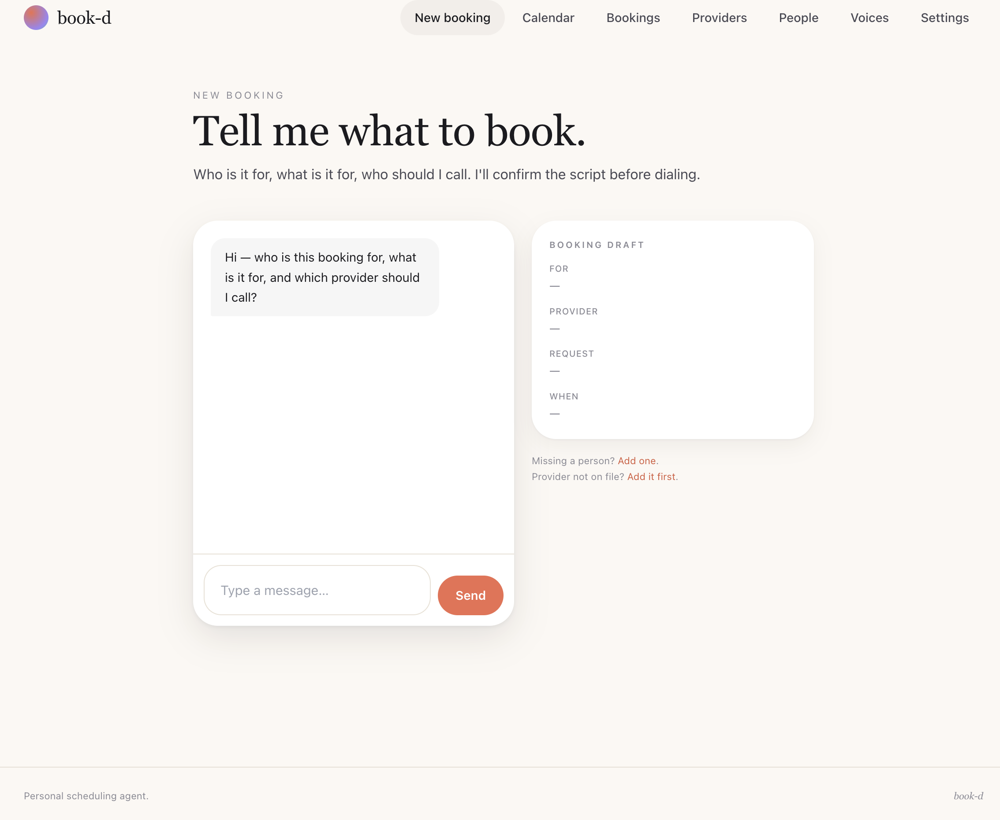

# book-d

[](https://www.npmjs.com/package/create-bookd) [](./LICENSE) [](#requirements) [](./CONTRIBUTING.md)

<!-- Add a portal screenshot: drop docs/portal.png in the repo and uncomment the next line -->
<!-- <p align="center"></p> -->

**A personal AI phone-booking agent that runs on your machine.** It calls a business for you — navigates the phone tree, waits on hold, talks to the receptionist to book an appointment — and patches *you* in for the moments that actually need a human. Comes with a local web portal to add who/where/when and watch calls unfold.

Booking by phone steals your workday: offices are only open while you're at work, and 95% of every call is menus and hold music. book-d eats that part.

> Built in the open. Runs **local-first** — your data lives in a single SQLite file on your machine, PII/PHI encrypted at rest. MIT licensed.

---

## Quick start

```bash
npx create-bookd my-agent        # scaffold + install + setup wizard
cd my-agent/web && npm run dev    # portal at http://localhost:3000
```

Or clone manually:

```bash
git clone https://github.com/arunash/bookd.git
cd bookd/web && npm install
npm run setup                     # generates secrets, asks for your Vapi keys, creates the DB
npm run dev
```

You can click through the portal with **no accounts at all**. To place a *real* call you need a [Vapi](https://vapi.ai) account (the voice runtime) and a phone number — the wizard asks for those two values.

---

## How it works

```
  YOUR PORTAL (Next.js, localhost)                 VOICE RUNTIME (Vapi)
  ┌────────────────────────────┐   POST /call      ┌─────────────────────┐
  │ providers · people · reqs  │ ────────────────► │ Deepgram  → ears     │
  │ SQLite (encrypted PII)     │  {assistant cfg}  │ gpt-4o    → brain    │──► ☎ the office
  │ lib/vapi.ts = the prompt   │ ◄──── poll ─────  │ 11labs    → mouth    │
  └────────────────────────────┘  call outcome     └─────────────────────┘
```

- **The portal** holds your providers, the people you book for, and booking requests. It builds the agent's instructions and kicks off the call.
- **Vapi** runs the live conversation (speech-to-text, the LLM brain, text-to-speech) and dials out through your number.
- **The brain** is one prompt (`web/lib/vapi.ts`): navigate menus with the keypad, reach a live human, disclose it's an AI, share only the minimum info asked for, and **hand off to you** when it hits a question it shouldn't answer (a clinical question, a payment, anything requiring judgment).
- **No public webhook / no tunnel required.** Locally, book-d *polls* Vapi for the call result instead of receiving a webhook — so there's no ngrok/reverse-proxy step.

## What's private by design

- **Local SQLite** — one file (`web/dev.db`), no cloud database.
- **Encryption at rest** — names, DOB, insurance IDs, and any card details are AES-256-GCM encrypted with a key generated on setup. A stolen DB file alone is useless.
- **Minimum-necessary on calls** — the agent gives one specific field when asked for that field; it never volunteers your full record and never reads out card numbers.

## Cost

book-d is free. The voice runtime is not: **Vapi + telephony minutes + the LLM** are billed by Vapi to your own account (typically cents per minute). You bring your own keys; nothing runs through the maintainer.

---

## ⚠️ Responsible use — read this

book-d places **real outbound phone calls**. You are responsible for using it lawfully and ethically:

- **Disclose it's an AI.** The default prompt does this on every call. Don't remove it.
- **Get consent & don't deceive.** Only call businesses you legitimately need to transact with, on your own behalf.
- **Obey the law.** Robocalling / autodialing and call-recording rules vary by jurisdiction (e.g. TCPA in the US; two-party-consent states; GDPR). Recording is **off by default** — keep it that way unless you know your local law. Never use book-d for spam, mass calling, harassment, or impersonation.
- **No warranty.** This is provided "as is" (see LICENSE). You assume all responsibility for the calls it makes.

If you can't use it in line with the above, don't use it.

---

## Project layout

```
bookd/
├─ web/                    # the portal + agent (Next.js 14, Prisma, SQLite)
│  ├─ lib/vapi.ts          # the agent's prompt & call config — the "brain"
│  ├─ prisma/schema.prisma # local SQLite schema
│  └─ prisma/seed.mjs      # optional demo providers
├─ scripts/setup.mjs       # the setup wizard
└─ LICENSE                 # MIT
```

## Requirements

- Node 18+
- A [Vapi](https://vapi.ai) account + phone number (to place real calls)
- Optionally an Anthropic API key (to parse free-text booking requests)

## Contributing

Issues and PRs welcome — this is a community project. Good first areas: additional voice-runtime adapters, better provider "playbooks" (learned phone-tree paths), and calendar integrations.

## License

MIT © 2026 — see [LICENSE](./LICENSE).
